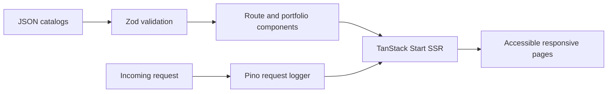

# Montasim Portfolio v2

> A production-oriented software engineering portfolio for recruiters, collaborators, and technical peers.

Montasim Portfolio v2 turns a static multi-page prototype into a server-rendered TanStack Start application. It preserves the prototype's compact editorial interface while adding reusable components, typed file-based routes, validated JSON content, structured server logging, responsive navigation, dark mode, and complete social-sharing metadata.


## Why this project?

The original prototype proved the content and visual direction, but its repeated HTML, CDN scripts, and page-local styles made ongoing changes expensive. This implementation keeps the approved interface while giving the portfolio one maintainable application shell and a small set of reusable content patterns.

The result is designed for two audiences:

- Visitors can scan experience, projects, skills, education, certifications, and recommendations on any screen size.
- Contributors can update structured JSON catalogs without adding a database or duplicating page markup.

## Current capabilities

- Full-document server rendering through TanStack Start
- Eight typed routes with route-specific titles, descriptions, canonical links, Open Graph tags, and Twitter card metadata
- Responsive desktop navigation and an accessible shadcn `Sheet` menu on small screens
- System-aware light and dark themes with a persistent manual toggle
- Filterable project, education, certification, and recommendation catalogs
- Reusable experience timelines, project cards, skill groups, page introductions, section headings, and footer actions
- Zod validation for every JSON content catalog during application startup
- Structured Pino request logs with authorization and cookie redaction
- Optimized WebP interface assets plus a 1200 by 630 PNG social preview
- Static `robots.txt`, XML sitemap, web app manifest, resume, and credential downloads

## Explore the portfolio

| Route              | Purpose                              |
| ------------------ | ------------------------------------ |
| `/`                | Portfolio overview and contact path  |
| `/experience`      | Complete role and company history    |
| `/projects`        | Filterable project catalog           |
| `/skills`          | Complete skills catalog              |
| `/education`       | Filterable academic history          |
| `/certifications`  | Filterable professional credentials  |
| `/recommendations` | Expandable colleague recommendations |
| `/resume`          | Web resume and PDF download          |

The original approved static pages remain in [`prototype/`](prototype/) for visual comparison. They are reference artifacts, not application entry points.

## Local development

### Prerequisites

- Node.js 22.12 or newer
- pnpm 11 or newer

No database, third-party account, environment file, or external service is required.

### Install and run

From the project directory:

```bash
pnpm install
pnpm dev
```

Open [http://localhost:3000](http://localhost:3000).

### Production build preview

```bash
pnpm build
pnpm preview
```

`pnpm preview` verifies the generated Vite output locally. It is not a production hosting process.

## How it works



Route files own page composition and metadata. Portfolio components own repeated presentation patterns. The shared content module validates imported JSON before exposing typed values, so malformed content fails during development and builds instead of reaching visitors silently.

The server entry wraps TanStack Start's default handler to record the request method, path, response status, and elapsed time. It redacts authorization and cookie fields from structured logs.

## Project structure

```text
src/
├── components/
│   ├── layout/       # Application shell, navigation, footer, side rails
│   ├── portfolio/    # Experience, project, and skill patterns
│   ├── shared/       # Page introductions, filters, headings, rich text
│   └── ui/           # Owned shadcn components
├── data/             # JSON content catalogs
├── lib/              # Validation, metadata, assets, logging, utilities
├── routes/           # TanStack Router file-based routes
├── router.tsx        # Router configuration
├── server.ts         # SSR entry and Pino request logging
└── styles.css        # Tailwind imports and shadcn theme tokens
public/               # Images, PDFs, manifest, robots, and sitemap
prototype/            # Approved static reference implementation
```

## Technology

| Area        | Technology                                            |
| ----------- | ----------------------------------------------------- |
| Application | TanStack Start, TanStack Router, React 19, TypeScript |
| Build       | Vite 8                                                |
| Interface   | Tailwind CSS 4, shadcn/ui, Radix UI, Phosphor Icons   |
| Validation  | Zod 4                                                 |
| Logging     | Pino 10                                               |
| Content     | Local JSON files                                      |
| Testing     | Vitest                                                |
| Quality     | ESLint, Prettier, TypeScript, Lighthouse              |

## Updating content

Edit the relevant file in [`src/data/`](src/data/):

- `profile.json` for identity, summary, and social links
- `experience.json` for roles and companies
- `projects.json` for the project catalog
- `skills.json` for grouped capabilities
- `education.json`, `certifications.json`, and `recommendations.json` for supporting credentials
- `organizations.json` and `volunteering.json` for community work

Keep public asset paths rooted at `/images` or `/documents`. Run `pnpm test` and `pnpm typecheck` after changes; the Zod schemas reject missing or invalid required values.

## Development commands

| Command          | Purpose                                     |
| ---------------- | ------------------------------------------- |
| `pnpm dev`       | Start the development server on port 3000   |
| `pnpm build`     | Create client and server production bundles |
| `pnpm preview`   | Preview the production build locally        |
| `pnpm test`      | Run the Vitest suite once                   |
| `pnpm typecheck` | Check TypeScript without emitting files     |
| `pnpm lint`      | Run ESLint                                  |
| `pnpm format`    | Format TypeScript and JavaScript files      |
| `pnpm check`     | Check TypeScript and JavaScript formatting  |

The verified release gate is:

```bash
pnpm lint
pnpm test
pnpm typecheck
pnpm build
```

## Verified quality

The current implementation passes ESLint, two Vitest content and metadata checks, TypeScript, and a production build. A local Lighthouse run against the warmed production preview reported:

| Category       | Score |
| -------------- | ----: |
| Performance    |    91 |
| Accessibility  |   100 |
| Best practices |   100 |
| SEO            |   100 |

The same run measured a cumulative layout shift of `0.002`, total blocking time of `50 ms`, and a warmed server response time of `10 ms`. Lighthouse results vary by machine and throttling profile, so these values are verification evidence rather than a performance guarantee.

## SEO and social sharing

Every route uses TanStack Router document-head management for deduplicated metadata. The application includes:

- Unique route titles and descriptions
- Canonical URLs rooted at `https://montasim.vercel.app`
- Open Graph and Twitter large-card metadata
- A 1200 by 630 PNG preview at `public/images/social-preview.png`
- Crawl directives in `public/robots.txt`
- All public routes in `public/sitemap.xml`
- A web app manifest with an optimized icon

Update the canonical URL in [`src/lib/site.ts`](src/lib/site.ts), `public/robots.txt`, and `public/sitemap.xml` before deploying to a different domain.

## Deployment

The repository does not currently include a provider-specific deployment adapter or verified v2 deployment. Select the TanStack Start adapter for the target runtime, configure that platform to run `pnpm build`, and verify server-side rendering, static assets, canonical URLs, and the social preview in the deployed environment.

Do not present `pnpm preview` as the production server.

## Status and limitations

- This is a portfolio application backed by version-controlled JSON, not a content management system.
- Content changes require a rebuild and redeployment.
- Filters run in the browser after the initial server-rendered page loads.
- External project, credential, institution, and social links can change independently of this repository.
- The contact action opens the visitor's email client; there is no form submission or personal-data store.
- The canonical production domain is configured but the v2 deployment has not been verified from this repository.
- The current home-route JavaScript bundle triggers Vite's 500 KB warning, although its compressed transfer size is approximately 160 KB. Further catalog splitting is a future optimization.

## Support and security

For portfolio questions, use the email action in the application. Reproducible implementation problems should be reported through the repository's issue tracker after the project is published.

This application has no authentication, database, or write API. Do not add secrets to JSON catalogs or files under `public/`; everything there is shipped to visitors. Report security concerns privately to the maintainer rather than disclosing sensitive details publicly.

## Contributing

Focused fixes and content corrections are welcome. Keep changes modular, preserve the approved prototype's information architecture and visual language, and run the complete release gate before submitting work.

The repository does not currently include separate contribution or code-of-conduct documents.

## Funding

Optional support is available through [SupportKori](https://www.supportkori.com/montasim). Code reviews, bug reports, and useful feedback are equally valuable.

## Author

Built and maintained by [Montasim](https://github.com/montasim).

## License

This project does not currently include an open-source license. Source availability does not grant permission to copy, modify, or redistribute it.
